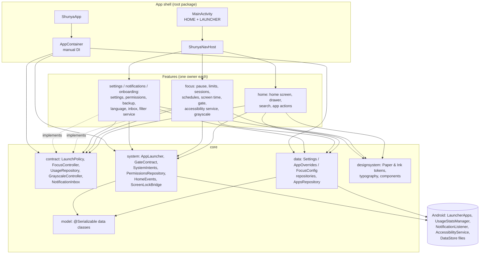
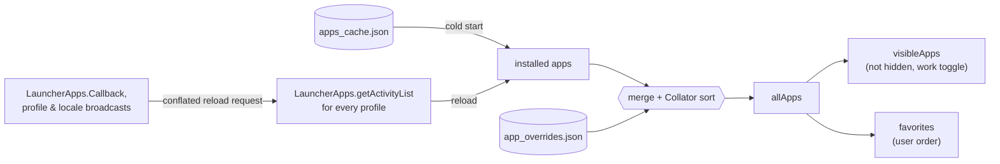
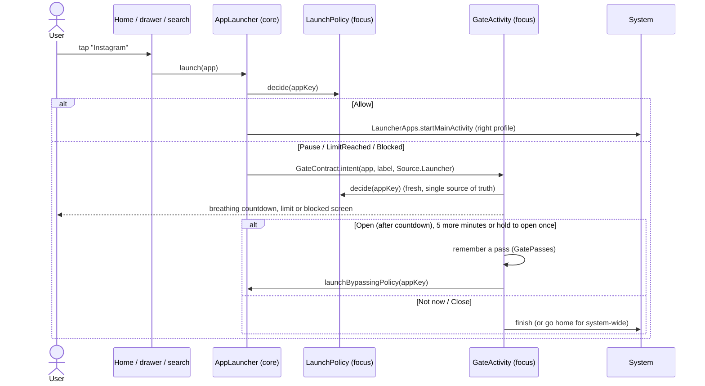

# Shunya — architecture

This document explains how Shunya is put together and why. The product itself is in
[PRD.md](PRD.md).

## 1. What drives the design

| Product principle (PRD §1) | Architectural consequence |
|---|---|
| **Instant.** Home must feel immediate. | No I/O on the home path. State is held in hot `StateFlow`s. The app list is cached on disk and shown before the live query returns. Icons are never loaded. |
| **Private and offline.** | No INTERNET permission. Everything is local: DataStore files and platform services. |
| **Honest friction.** | One choke point for launching apps (`AppLauncher`) and one rule engine (`LaunchPolicy`). Launcher launches and system-wide blocking therefore behave the same way. |
| **Graceful degradation.** | Every special access (usage, notifications, accessibility, secure settings) is optional. Each contract returns safe defaults instead of throwing. |
| **Respect the platform.** | Back never leaves home and Home always returns there. Layout is edge-to-edge, text follows the font scale, and every action has a non-gesture path. |
| **Bilingual.** | Every string is a resource in `values` and `values-bn`. Sorting is locale-aware, and Bangla gets a fallback font. |


## 2. The big picture



Dependency rules, enforced by review and by package ownership:
- **Features depend on `core/**` and never on each other.** Home needs to know whether an app is
  blocked, and it asks the `LaunchPolicy` interface, not the focus package.
- **`core` never imports a feature.** The few feature components that core must address (the gate
  activity and the two services) are referenced by class-name strings in `ShunyaComponents`, which
  also appear in the manifest.
- **Pure rules live in `logic/` packages.** These are search ranking, the calculator, schedule
  evaluation, usage aggregation, launch decisions, backup mapping and hold rules. They use no
  Android imports and have JUnit tests.

## 3. Layers

**App shell.** `ShunyaApp` creates one `AppContainer` per process, with an app-wide
`CoroutineScope(SupervisorJob() + Dispatchers.Default)`. `MainActivity` is the only UI activity for
normal use. It is `singleTask`, `stateNotNeeded`, excluded from recents, and its `configChanges`
avoid recreation on rotation, dark mode, density and keyboard changes. It hosts Compose, the theme
and navigation. `GateActivity` is a second, isolated activity in its own task so it can appear on
top of any app.

**Dependency injection.** `AppContainer` is plain Kotlin:
- Singletons are `by lazy`, typed by their `core` interface.
- Each feature has one marked region, which keeps feature branches merge-free.
- Settings, overrides and the app list are created eagerly because the first frame needs them.
- Composables get the container from `LocalAppContainer`; services and activities use `context.appContainer`.

**Persistence.** Three typed DataStore files hold JSON through one `Json` configuration. It ignores
unknown keys, encodes defaults and coerces unknown enum values, so schema evolution needs no migration
code: `settings.json`, `app_overrides.json` and `focus_config.json`, plus the inbox and the app-list
cache. `StoredValue<T>` wraps each file:
- `state` is always hot and non-blocking (defaults until the file is read).
- `isLoaded` says when the file has been read.
- `update { }` is an atomic read-modify-write.
- `edit { }` is fire-and-forget on the app scope. It is safe when the screen closes, and a failed write is dropped instead of crashing.

**App list.** `LauncherAppsRepository` is the heart of the launcher:



Reload requests go through a conflated channel, so a burst of package events costs one query. The
cache is rewritten only when the list changes. Sorting uses `java.text.Collator` at primary strength
in the current locale, so case, accents and Bangla are all ordered naturally.

**Navigation.** The navigation is in-house (about 150 lines) instead of the Navigation library:
- `Route` is a sealed interface listing every destination. `ShunyaNavHost` maps each route to one entry composable in the owner's package.
- `Navigator` keeps a snapshot-state back stack of `NavEntry`s. Each entry is a `ViewModelStoreOwner`, so `viewModel { }` lives exactly as long as its screen is on the stack. Entries are cleared after their exit animation, and saved UI state is keyed per entry.
- The back stack lives in a `ViewModel`, so it survives the recreation caused by a language switch.
- Back handling is layered: inner `BackHandler`s (drawer, sheets) win over the host, which pops a screen. A root handler in `MainActivity` swallows Back on Home, so Back never exits.
- The Home button arrives in `onNewIntent`. The navigator pops to root and `HomeEvents` tells the home screen whether to animate (already home) or snap back (returning from another app). The check uses window focus and `FLAG_ACTIVITY_BROUGHT_TO_FRONT`, as Launcher3 does.

**Design system.** "Paper & Ink" is a small set of tokens with no accent colour:
- Colours are background, ink, ink at 60 / 38 / 12 % opacity, surface, scrim and danger.
- There is a ten-style type scale multiplied by the user's text-size choice, and spacing on a 4 dp grid.
- About fifteen components cover every screen.
- A Material 3 colour scheme and typography are generated from the tokens, so any M3 widget blends in.
- Bundled Latin fonts lack Bengali glyphs. In a Bangla UI the theme therefore renders with Hind Siliguri, which covers both scripts, unless the user chose the system font.
- The window itself shows the wallpaper. Compose paints the solid theme background unless wallpaper mode is on, in which case home draws a dim scrim in the theme colour.

## 4. Data flow on a screen

Each screen follows unidirectional data flow:

```
Repository StateFlow ──▶ ViewModel (combine / map / stateIn) ──▶ UiState ──▶ Screen composable
        ▲                                                                        │
        └──────────────── repository.edit { … } ◀── ViewModel intent ◀─── user event
```

Entry composables resolve their dependencies from `LocalAppContainer`, create the ViewModel with
`viewModel { … }` and pass plain state plus lambdas to a stateless screen composable. Permissions
can't be observed, so `PermissionsRepository.refresh()` runs on every resume. Screens that send
the user to system settings refresh again when they return.

## 5. The launch gate (the focus core)

Every launch from Shunya goes through one path:



The policy evaluates `LaunchRules` (pure Kotlin, unit-tested) with a fixed precedence:
**Blocked** (focus session or active schedule, distracting apps only) >
**LimitReached** (today's usage ≥ limit + today's extension) > **Pause** (distracting) > **Allow**.
The fast path returns Allow without touching usage data for apps that are neither distracting nor
limited. Any failure also means Allow: a broken rule must never lock the user out of their phone.

**System-wide blocking** is opt-in and needs the accessibility service. The service listens only to
window-state changes, never to window content. `ForegroundFilter` separates "a real app came to the
front" from noise: the keyboard, system UI, launchers, recents and the app's own dialogs. For a
blocked or over-limit app the service opens the same gate with `Source.SystemWide`, whose "Not now"
goes home. `GatePasses` stops the gate from bouncing straight back after the user chose "Open".
The mindful pause stays launcher-only by design: pausing every notification tap would be friction
without intent.

**Sessions and schedules need no alarms.** Focus state is evaluated on demand from `FocusConfig`
and the clock, on every decision and on a ticker while the UI observes it. There are no background
alarms, wake-ups or exact-alarm permissions. Overnight schedules are handled by the pure schedule
rules.

## 6. Notifications

`NotificationFilterService` (a `NotificationListenerService`) applies pure `HoldRules`. It never holds
ongoing, foreground-service or group-summary notifications, or notifications from allowed apps.
The built-in allowed list is the default dialer, SMS, clock, calendar and Shunya itself. The service
cancels a held notification from the shade and stores it in the inbox store (capped at 300, newest
first). Opening an item from the Inbox also asks the `LaunchPolicy`, so the Inbox is no back door
around focus.

## 7. Verification strategy

| Layer | How it is checked |
|---|---|
| Pure logic (`logic/`) | JUnit 4 on the JVM via `gradlew testDebugUnitTest` |
| Resources and manifest | aapt2 at build time; Android lint (`gradlew lint`) for missing translations |
| Android APIs | conservative, long-stable API forms, SDK guards above API 26 |

## 8. Decisions and trade-offs

| Decision | Why | Cost / trade-off |
|---|---|---|
| Manual DI (`AppContainer`) instead of Hilt/Koin | no annotation processing or KSP; readable, fast builds; one object graph | wiring by hand; no scoping beyond app and screen |
| DataStore with JSON instead of Room | small documents; atomic updates; schema evolution by defaults; trivial backup | no queries; whole-document writes (fine at this size) |
| In-house navigation | launcher-specific Back and Home semantics; per-screen ViewModel stores in about 150 lines | no deep links or type-safe arguments library (not needed) |
| Contracts in `core`, implementations in features | features were built on parallel branches without merge conflicts; features are testable in isolation | a few indirections (e.g. `LaunchPolicy` behind `AppLauncher`) |
| Text only, no icons | the product's identity; also makes cold start and memory trivial | recognition relies on names (renaming and fuzzy search compensate) |
| On-demand focus evaluation, no alarms | no background work, no exact-alarm permission, battery-neutral | schedule side effects (grayscale) apply the next time Shunya evaluates, not at the exact minute |
| Accessibility service opt-in, window events only | honest and minimal; Play policy friendly (prominent disclosure first) | without it, blocking covers launches from Shunya only (stated in the UI) |
| Notification shade via `StatusBarManager` reflection | what every third-party launcher does; no extra permission prompts | may be refused on some ROMs; the accessibility service and a toast are the fallbacks |
| Grayscale via secure settings (ADB grant) | the only way without being a system app | one-time computer step, explained in-app with a copy button |
| Hind Siliguri for a Bangla UI | consistent weight and metrics across both scripts | the chosen Latin font is not used in Bangla (except "System") |
| Wallpaper through the window (`windowShowWallpaper`) | zero-cost wallpaper mode; no wallpaper reading permission | the host must paint the background in solid mode (it does) |
| Minimal permissions, no INTERNET | privacy as a feature | no crash reporting: users send logs manually |

## 9. Known limitations

- The home screen does not scroll, so 8 favorites at XL text can overflow a very small phone.
- There is no UI for per-app pause lengths or custom focus durations; the model supports both.
- Usage numbers are cached for up to 20 s.
- Held notifications keep a title and one text line.
- A held notification's original tap action is lost when the process dies; opening it then starts the app.
